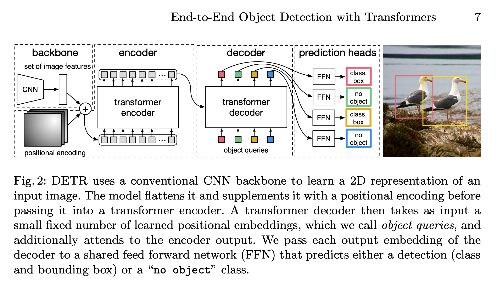
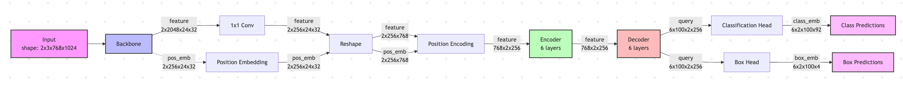
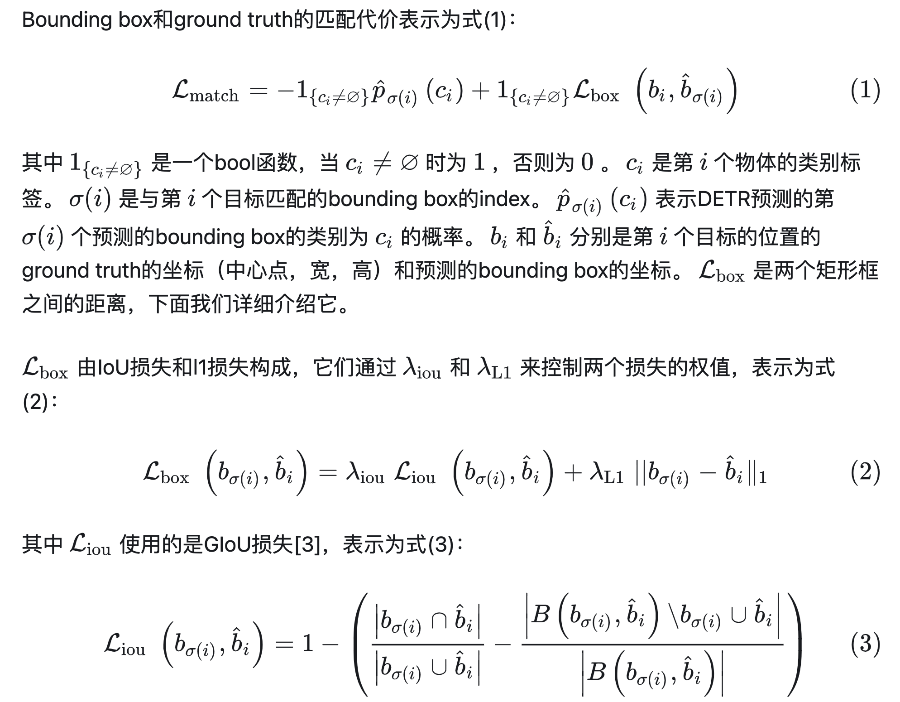
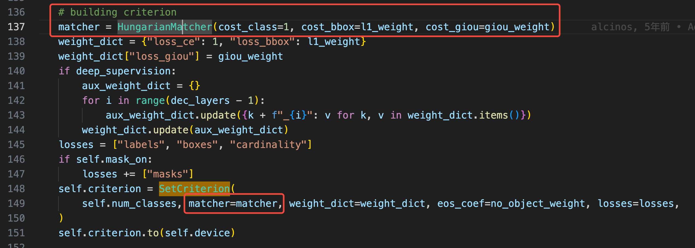
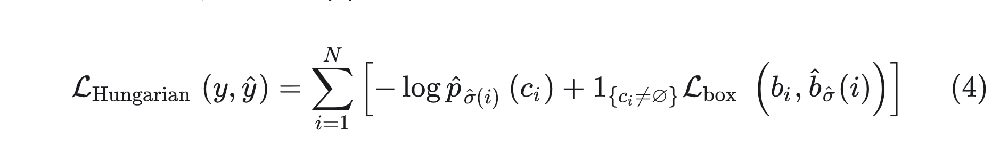
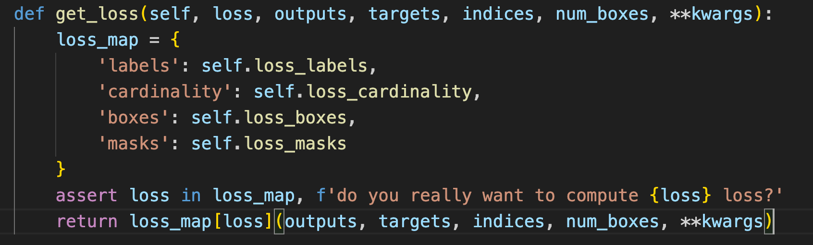
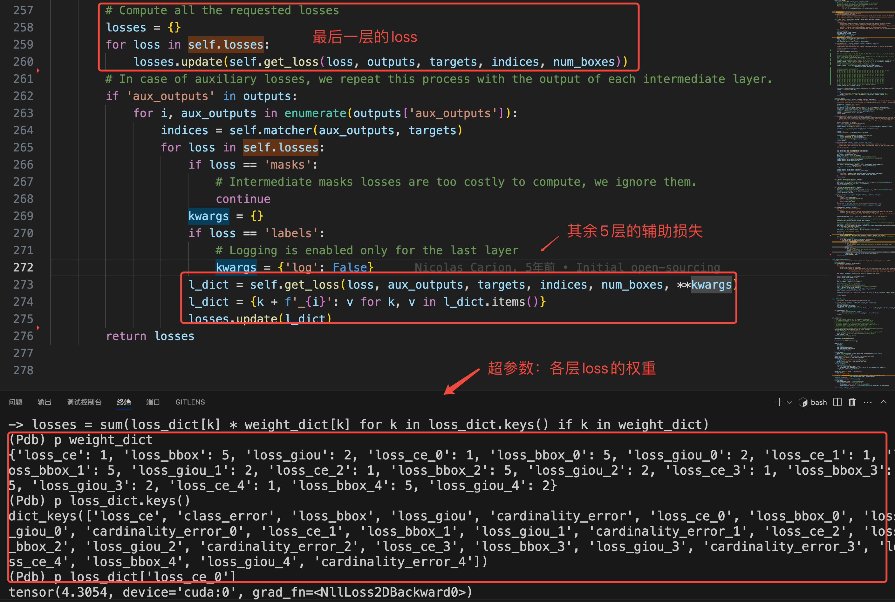

# 论文解读
b站链接： https://www.bilibili.com/video/BV1GB4y1X72R/?spm_id_from=333.337.search-card.all.click

知乎文章: https://zhuanlan.zhihu.com/p/387102036

github: https://github.com/facebookresearch/detr/

论文：https://arxiv.org/abs/2005.12872

# 网络结构
DETR的网络结构如图所示，从图中可以看出DETR由四个主要模块组成：backbone，编码器，解码器以及预测头。

对应的网络结构特征图变化如下：

## 结构解读

| 节点        | 说明                            |
|-------------|---------------------------------|
| Input       | 输入图像 [B,C,H,W]         |
| Backbone    | 提取特征  [B,C1,H1,H1]，resnet50中：H1=H/32                      |
| Pos Emb     | 添加位置编码 [B,C1,H1,W1]                 |
| 1x1 Conv    | 通道降维到 [B,C2,H1,W1]                  |
| Reshape     | 将最后两个维度 HxW 展平为序列长度 L [B,C2,L]        |
| Permute     | 转置以适配 transformer 接口 [L,B,C2]    |
| Encoder     | 处理全局特征  [L,B,C2]                  |
| Decoder     | 基于 object Query 解码出目标特征, D:解码器层数，默认是6，N:超参数，coco:100，每张图产生的检测框数量(L->N) [D,N,B,C2] |
| Transpose   | 交换维度：[D,B,N,C2] |
| Class Head  | 输出类别 logits（coco:92类:C2->C3）  [D,B,N,C3]      |
| BBox Head   | 输出归一化坐标（4维：c_x,c_y,h,w: C3->4）() [D,B,N,4]           |

以Batch=2,H=768,W=1024的输入为例，说明网络的输入输出shape情况：


# 匹配和损失
按照文章中所说，网络结构产生N个预测结果(类别+bbox)，同时GT也是N个结果(真实目标+空目标背景类)，第一步先做匹配，第二步基于匹配的结果计算loss
## 匹配
### linear_sum_assignment
先了解一个匹配的任务：N个工人，M个任务，如何分配任务，使得成本最低， 算法上是一个动态规划问题，即匈牙利匹配算法：参考[知乎介绍](https://zhuanlan.zhihu.com/p/307751815),[scipy官网实现](https://docs.scipy.org/doc/scipy/reference/generated/scipy.optimize.linear_sum_assignment.html#scipy.optimize.linear_sum_assignment)
换到本例中：N个pred_box，M个gt_box，如何分配使得代价最低, 因此就需要计算代价函数,在bbox的分配中，如何构建代价函数？

### 匹配的代价函数
匹配的计算规则如下，代价函数=类别损失+BBOX损失(L1_loss+GIOU_loss)

对应的代码如下：

理论部分解释完，看一下实际运行的代码：其中网络输出之后变换得到pred_loits[2,100,92],pred_boxes[2,100,4]，是decoder_layer最后一层的输出，其余5层的输出保存到aux_outputs中的。
```python
# 将[D,B,N,C3]，[D,B,N,4]拆分为两部分：最后一层和其它层
out = {'pred_logits': outputs_class[-1], 'pred_boxes': outputs_coord[-1]}
if self.aux_loss:
    out['aux_outputs'] = self._set_aux_loss(outputs_class, outputs_coord)
return out
```
然后最后一层的输出，和targets进入匹配函数。<span style="color:red"><strong>匹配函数只关注有目标的GT</strong></span>

```python
# 版权所有 (c) Facebook, Inc. 保留所有权利
"""
该模块用于计算匹配代价，并求解对应的线性和指派问题（LSAP）。
"""
import torch
from scipy.optimize import linear_sum_assignment
from torch import nn

from util.box_ops import box_cxcywh_to_xyxy, generalized_box_iou

class HungarianMatcher(nn.Module):
    """
    本类用于在网络预测结果和目标之间建立匹配关系。

    出于效率考虑，targets 中不包含“no_object”（即背景类）。因此通常预测数多于目标数。
    在这种情况下，我们会将预测与目标做一对一最优匹配，其余未匹配的预测被视为“非目标”。
    """

    def __init__(self, cost_class: float = 1, cost_bbox: float = 5, cost_giou: float = 2):
        """
        初始化匹配器： cost = cost_class * class_w + cost_bbox * box_w + cost_giou * giou_w

        参数：
            cost_class: 分类误差的权重
            cost_bbox: 边界框坐标 L1 误差的权重
            cost_giou: GIoU 损失的权重
        """
        super().__init__()
        self.cost_class = cost_class
        self.cost_bbox = cost_bbox
        self.cost_giou = cost_giou
        assert cost_class != 0 or cost_bbox != 0 or cost_giou != 0, "所有代价不能同时为0"

    @torch.no_grad()
    def forward(self, outputs, targets):
        """
        执行匹配操作

        参数：
            outputs: 字典，包含至少以下内容：
                - "pred_logits": 维度为 [batch_size, num_queries, num_classes] 的分类预测张量
                - "pred_boxes": 维度为 [batch_size, num_queries, 4] 的边界框预测张量

            targets: 长度为 batch_size 的目标列表，每个目标是一个字典，包含：
                - "labels": 维度为 [num_target_boxes] 的类别标签张量
                - "boxes": 维度为 [num_target_boxes, 4] 的目标边界框张量

        返回：
            长度为 batch_size 的列表，每项是一个元组 (index_i, index_j)，其中：
                - index_i 是被选中预测的索引
                - index_j 是与之匹配的目标索引
            对每个 batch 样本，有：
                len(index_i) = len(index_j) = min(num_queries, num_target_boxes)
        """
        bs, num_queries = outputs["pred_logits"].shape[:2]

        # 展平，方便批量计算代价矩阵
        out_prob = outputs["pred_logits"].flatten(0, 1).softmax(-1)  # [bs * num_queries, num_classes]
        out_bbox = outputs["pred_boxes"].flatten(0, 1)  # [bs * num_queries, 4]

        # 合并batch内目标的标签和边界框
        tgt_ids = torch.cat([v["labels"] for v in targets])  # [num_tgt]
        tgt_bbox = torch.cat([v["boxes"] for v in targets])  # [num_tgt,4]

        # 计算分类代价，p(target class)即预测正确的概率，而 1 - p(target class) 则表示cost.
        # 另外指定了tgt_ids，只关心有目标的对象。
        # 额外注意的一点： cost_class代价，有点跨图片了，tgt_ids是所batch内部所有目标的label_id
        # 按道理单张图片的目标匹配应该在单图内部计算，而不是同一个batch内部计算？ 真实这样吗？看看后续
        cost_class = -out_prob[:, tgt_ids]  # [bs * num_queries,num_tgt]

        # 计算 L1 框坐标代价
        cost_bbox = torch.cdist(out_bbox, tgt_bbox, p=1)  # [bs * num_queries,num_tgt]

        # 计算 GIoU 框之间的代价: [bs * num_queries,num_tgt]
        cost_giou = -generalized_box_iou(box_cxcywh_to_xyxy(out_bbox), box_cxcywh_to_xyxy(tgt_bbox))

        # 最终代价矩阵
        C = self.cost_bbox * cost_bbox + self.cost_class * cost_class + self.cost_giou * cost_giou
        C = C.view(bs, num_queries, -1).cpu()

        # 下面这两行代码才是关键！！C.split(sizes, -1)将代价函数拆分为单张图片的代价，避免了
        # 对单张图片的目标匹配函数执行匈牙利代价匹配：linear_sum_assignment(c[i])，c[i]就是batch内每张图的代价矩阵
        sizes = [len(v["boxes"]) for v in targets]
        indices = [linear_sum_assignment(c[i]) for i, c in enumerate(C.split(sizes, -1))]
        # indices是一个list，[(x1_list,y1_list),(x2_list,y2_list)],x1_list是第一张图最佳匹配的横坐标,y1_list是纵坐标
        # [(tensor([ 8, 27, 39, 50, 54, 67, 69, 77]), tensor([6, 4, 7, 0, 5, 1, 3, 2])), (tensor([77]), tensor([0]))]
        return [(torch.as_tensor(i, dtype=torch.int64), torch.as_tensor(j, dtype=torch.int64)) for i, j in indices]
```

## loss
loss的构成包括：类别交叉熵损失和bbox损失。

来看看具体的代码实现


### 标签损失——交叉熵损失
```python
def loss_labels(self, outputs, targets, indices, num_boxes, log=True):
        """Classification loss (NLL)
        targets dicts must contain the key "labels" containing a tensor of dim [nb_target_boxes]
        """
        assert 'pred_logits' in outputs
        # [2,100,92]
        src_logits = outputs['pred_logits']

        # indice是：[(tensor([ 8, 27, 39, 50, 54, 67, 69, 77]), tensor([6, 4, 7, 0, 5, 1, 3, 2])), (tensor([77]), tensor([0]))]
        # indice中x是预测框的下标，y是gt框的下标
        # idx: (tensor([0, 0, 0, 0, 0, 0, 0, 0, 1]), tensor([ 8, 27, 39, 50, 54, 67, 69, 77, 77]))
        idx = self._get_src_permutation_idx(indices)
        # targets[labels]: [[18,  1,  1, 15, 27, 44, 84, 27],[6]]
        # 获取预测框对应的target框的下标，即通过[6, 4, 7, 0, 5, 1, 3, 2]->[84, 27, 27, 18, 44,  1, 15,  1]
        target_classes_o = torch.cat([t["labels"][J] for t, (_, J) in zip(targets, indices)])
        # target_classes_o:[84, 27, 27, 18, 44,  1, 15,  1,  6]
        # 填充一个[2,100]的target_classes,填充值为91，最后一个负类别
        target_classes = torch.full(src_logits.shape[:2], self.num_classes,
                                    dtype=torch.int64, device=src_logits.device)
        
        # 将indices获得匹配类别赋值预测框
        # tensor([[91, 91, 91, 91, 91, 91, 91, 91, 84, 91, 91, 91, 91, 91, 91, 91, 91, 91,
        #  91, 91, 91, 91, 91, 91, 91, 91, 91, 27, 91, 91, 91, 91, 91, 91, 91, 91,
        #  91, 91, 91, 27, 91, 91, 91, 91, 91, 91, 91, 91, 91, 91, 18, 91, 91, 91,
        #  44, 91, 91, 91, 91, 91, 91, 91, 91, 91, 91, 91, 91,  1, 91, 15, 91, 91,
        #  91, 91, 91, 91, 91,  1, 91, 91, 91, 91, 91, 91, 91, 91, 91, 91, 91, 91,
        #  91, 91, 91, 91, 91, 91, 91, 91, 91, 91],
        # [91, 91, 91, 91, 91, 91, 91, 91, 91, 91, 91, 91, 91, 91, 91, 91, 91, 91,
        #  91, 91, 91, 91, 91, 91, 91, 91, 91, 91, 91, 91, 91, 91, 91, 91, 91, 91,
        #  91, 91, 91, 91, 91, 91, 91, 91, 91, 91, 91, 91, 91, 91, 91, 91, 91, 91,
        #  91, 91, 91, 91, 91, 91, 91, 91, 91, 91, 91, 91, 91, 91, 91, 91, 91, 91,
        #  91, 91, 91, 91, 91,  6, 91, 91, 91, 91, 91, 91, 91, 91, 91, 91, 91, 91,
        #  91, 91, 91, 91, 91, 91, 91, 91, 91, 91]], device='cuda:0')
        target_classes[idx] = target_classes_o

        # loss_ce:4.39
        loss_ce = F.cross_entropy(src_logits.transpose(1, 2), target_classes, self.empty_weight)
        losses = {'loss_ce': loss_ce}

        if log:
            # TODO this should probably be a separate loss, not hacked in this one here
            losses['class_error'] = 100 - accuracy(src_logits[idx], target_classes_o)[0]
        return losses
```
### box损失
bbox的损失，同匹配时刻的，只计算具有真实框的L1和GIOU损失，就不详细解释了
```python
def loss_boxes(self, outputs, targets, indices, num_boxes):
        """Compute the losses related to the bounding boxes, the L1 regression loss and the GIoU loss
           targets dicts must contain the key "boxes" containing a tensor of dim [nb_target_boxes, 4]
           The target boxes are expected in format (center_x, center_y, w, h), normalized by the image size.
        """
        assert 'pred_boxes' in outputs
        idx = self._get_src_permutation_idx(indices)
        src_boxes = outputs['pred_boxes'][idx]
        target_boxes = torch.cat([t['boxes'][i] for t, (_, i) in zip(targets, indices)], dim=0)

        loss_bbox = F.l1_loss(src_boxes, target_boxes, reduction='none')

        losses = {}
        losses['loss_bbox'] = loss_bbox.sum() / num_boxes

        loss_giou = 1 - torch.diag(box_ops.generalized_box_iou(
            box_ops.box_cxcywh_to_xyxy(src_boxes),
            box_ops.box_cxcywh_to_xyxy(target_boxes)))
        losses['loss_giou'] = loss_giou.sum() / num_boxes
        return losses
```
### 预测类别误差损失
这个损失，只用于log展示,不用于梯度传播，遇到后面如何匹配越好，这个loss会越来越小。
```python
def loss_cardinality(self, outputs, targets, indices, num_boxes):
    """ 
    """
    # [2,100,92]
    pred_logits = outputs['pred_logits']
    device = pred_logits.device
    # 统计一个一个batch内，每个tgt的数量[8,1]
    tgt_lengths = torch.as_tensor([len(v["labels"]) for v in targets], device=device)
    # 统计100个预测框中，预测为gt框类别的数量：[95,100]
    card_pred = (pred_logits.argmax(-1) != pred_logits.shape[-1] - 1).sum(1)
    # 计算L1损失
    card_err = F.l1_loss(card_pred.float(), tgt_lengths.float())
    losses = {'cardinality_error': card_err}
    return losses
```
### mask损失
这个是分割需要使用到的损失，暂时先不考虑吧

### 损失的组合
损失函数的构成看完了，我来看看最后如何组合，平衡这些loss吧：

