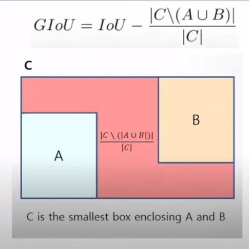
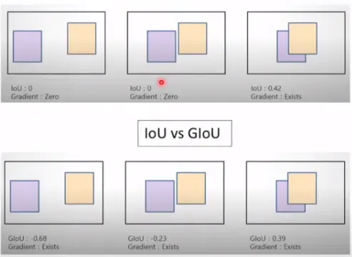
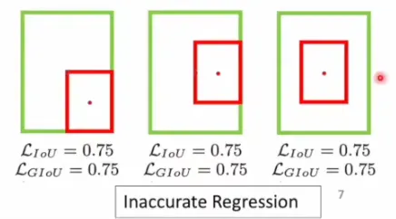
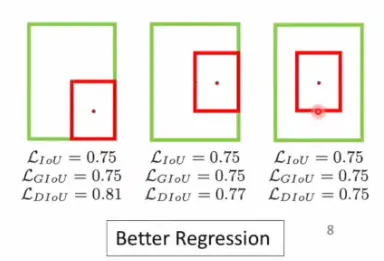

# 目标检测 Loss 发展路径综述

本文档梳理目标检测中 **定位损失（BBox Regression Loss）** 与 **分类损失（Classification Loss）** 的发展脉络，并给出各 Loss 的公式、优劣、代码实现与可视化说明，便于理解与复现。

---

## 一、发展时间线总览

```
L2/MSE → Smooth L1 → IoU → GIoU → DIoU → CIoU → EIoU/SIoU/α-IoU ...
         (Faster R-CNN)  (UnitBox)  (CVPR'19) (AAAI'20) (CVPR'20)

Cross Entropy → Focal Loss → Varifocal Loss → QFL / DFL (分类/质量估计)
                (ICCV'17)   (CVPR'21)         (YOLOX/RT-DETR等)
```

---

## 二、定位损失（BBox Regression Loss）

目标检测需要预测边界框 $(x, y, w, h)$ 或 $(x_1, y_1, x_2, y_2)$，定位损失衡量预测框与真实框的差异。

### 2.1 L2 / MSE Loss

**公式：**

$$
\mathcal{L}_{MSE} = \sum_{i \in \{x,y,w,h\}} (p_i - g_i)^2
$$

**特点：**

- 早期 R-CNN / Fast R-CNN 常用。
- 对离群值敏感，梯度易爆炸；且 $x,y,w,h$ 独立优化，与 IoU 等评价指标不一致。

| 优势               | 劣势                        |
| ------------------ | --------------------------- |
| 实现简单，可导性好 | 与 IoU 不直接对应，尺度敏感 |
| 训练稳定时收敛快   | 大误差时梯度大，易不稳定    |

**劣势补充说明：**

- **与 IoU 不直接对应、尺度敏感**：MSE 是「四个坐标各自误差的平方和」，而评测用的是 IoU（重叠面积/并集面积）。可能出现：四个坐标的 MSE 已经很小，但框只是整体平移了一点点，IoU 仍然不高；或者大框和小框差同样像素时，MSE 一样，但大框的 IoU 影响小、小框影响大，所以和「我们关心的指标」不一致。
- **大误差时梯度大、易不稳定**：梯度与误差成正比（$\nabla \propto (p_i - g_i)$）。若某次预测特别离谱（离群值），梯度会很大，更新步长过大，训练容易震荡甚至发散，需要小心学习率或梯度裁剪。

---

### 2.2 Smooth L1 Loss（Huber 型）

|x|<1 部分，使用L2的计算方式，避免离群值影响，同时避免l1计算在0点不可导的问题。

**公式：**

$$
\text{Smooth L1}(x) = \begin{cases}
0.5 x^2 & |x| < 1 \\
|x| - 0.5 & |x| \geq 1
\end{cases}
$$

Faster R-CNN 用其对 $x,y,w,h$ 做回归，替代 L2 以减轻离群值影响。

| 优势                           | 劣势                                     |
| ------------------------------ | ---------------------------------------- |
| 小误差二次、大误差一次，更鲁棒 | 仍是坐标独立回归，与 IoU 脱节            |
| 实现简单，广泛使用             | 未考虑框的几何关系（重叠、中心、宽高比） |

**劣势补充说明：**

- **仍是坐标独立回归、与 IoU 脱节**：Smooth L1 仍然对 $x,y,w,h$ 四个数分别算损失再相加，没有把「框」当作一个整体。模型可能把中心、宽高各自调得不错，但从「重叠面积」看并不最优；且评测用的是 IoU，优化目标与评测仍不一致。
- **未考虑框的几何关系**：不显式考虑两框是否重叠、中心是否对齐、宽高比是否一致。例如两个框中心重合、面积相同但宽高比相反时，Smooth L1 可能已经很小，但 IoU 仍可很低，不利于 NMS 和最终框质量。

---

### 2.3 IoU Loss

**出处：** UnitBox (ACM MM 2016) 等。

**公式：**

$$
\mathcal{L}_{IoU} = 1 - \text{IoU} = 1 - \frac{|A \cap B|}{|A \cup B|}
$$

直接优化 IoU，与评估指标一致。

| 优势                     | 劣势                                   |
| ------------------------ | -------------------------------------- |
| 与评估指标一致，尺度不变 | 无重叠时 IoU=0，梯度为 0，无法学习     |
| 将框当作整体优化         | 不同重叠程度梯度差异大，收敛行为不平滑 |

**劣势补充说明：**

- **无重叠时 IoU=0、梯度为 0，无法学习**：当预测框与真实框没有任何相交时，交集为 0，IoU 恒为 0，Loss 恒为 1；此时 IoU 对框的位置、大小都不敏感，数学上梯度为 0。模型无法从「不重叠」的预测中得到「该往哪边移动、放大还是缩小」的信息，这类样本对训练几乎没有贡献，甚至会让初期大量不重叠的框难以被拉回。
- **不同重叠程度梯度差异大、收敛不平滑**：IoU 从 0 变到 0.5 和从 0.8 变到 0.9，同样变化量带来的梯度可能差很多；且 IoU 对「轻微平移」在重叠较小时很敏感、在重叠较大时较钝，导致优化曲面的形状不均匀，训练时容易有时进步快、有时几乎不动。

**致命问题：** 当两框不重叠时 $\nabla \mathcal{L}_{IoU} = 0$，无法提供有效梯度。

---

### 2.4 GIoU Loss（Generalized IoU）

**出处：** _Generalized Intersection over Union_ (CVPR 2019)。

**公式：**

$$
\text{GIoU} = \text{IoU} - \frac{|C \setminus (A \cup B)|}{|C|}, \quad \mathcal{L}_{GIoU} = 1 - \text{GIoU}
$$

其中 $C$ 为包含 $A$ 和 $B$ 的最小闭包（最小外接矩形），增加了红色非重叠部分面积/C的面积，来解决不重叠时，梯度为0的情况。但是这个



| 优势             | 劣势                           |
| ---------------- | ------------------------------ |
| 不重叠时仍有梯度 |                                |
| 仍保持尺度不变性 | 收敛到「框对齐」的速度有时偏慢 |

**劣势补充说明：**

- **当两框呈包含关系时退化为 IoU、梯度仍可能弱，预测框不准**：GIoU 的惩罚项是「最小外接矩形 $C$ 中未被两框覆盖的比例」，因此倾向于减少C所占面积，而不是直接增加重叠度。当预测框完全包含真实框（或反过来）时，$C$ 就等于较大的那个框，这项变为 0，GIoU 就变成普通 IoU。此时若两框已经重叠得很好，只剩「缩小/放大以对齐边界」的需求，梯度可能仍然偏弱，收敛变慢。
- **收敛到「框对齐」的速度有时偏慢**：相比后来的 DIoU/CIoU，GIoU 没有显式约束「中心要对齐」「宽高比要一致」，只通过外接矩形的面积间接地拉近两框，所以从「大致重叠」到「精确对齐」的阶段，有时需要更多迭代。



---

### 2.5 DIoU Loss（Distance-IoU）

**出处：** _Distance-IoU Loss_ (AAAI 2020)。

**公式：**

$$
\mathcal{L}_{DIoU} = 1 - \text{IoU} + \frac{\rho^2(b, b^{gt})}{c^2}
$$

$\rho$ 为预测框中心与真实框中心的欧氏距离，$c$ 为最小外接矩形的对角线长度。

| 优势                         | 劣势                             |
| ---------------------------- | -------------------------------- |
| 显式约束中心点距离，收敛更快 | 未直接约束宽高比，长宽比可能不准 |
| 不重叠时梯度更合理           | -                                |

**劣势补充说明：**

- **未直接约束宽高比，长宽比可能不准**：DIoU 只加了「两框中心距离」的惩罚，没有管「形状」是否一致。例如真实框是竖长条（宽小高大），预测框可以是横扁的（宽大高小），只要中心重合、重叠足够，DIoU 也可以较小。因此可能出现中心对齐、重叠也不错，但宽高比明显不对的情况，影响最终框的视觉与评测（尤其 IoU 严格时）。



---

### 2.6 CIoU Loss（Complete IoU）

**出处：** 与 DIoU 同文 (AAAI 2020)。

**公式：**

$$
\mathcal{L}_{CIoU} = 1 - \text{IoU} + \frac{\rho^2(b, b^{gt})}{c^2} + \alpha v
$$

$$
v = \frac{4}{\pi^2}\left(\arctan\frac{w^{gt}}{h^{gt}} - \arctan\frac{w}{h}\right)^2, \quad
\alpha = \frac{v}{(1-\text{IoU})+v}
$$

在 DIoU 基础上增加宽高比一致性项 $v$。

| 优势                               | 劣势                                               |
| ---------------------------------- | -------------------------------------------------- |
| 同时考虑重叠、中心距离、宽高比     | $\alpha$ 与 $v$ 设计较复杂，实现需注意数值稳定 |
| 实际检测中应用广泛（如 YOLOv5/v8） | 极端形状或极端比例时需调参                         |

**劣势补充说明：**

- **$\alpha$ 与 $v$ 设计较复杂，实现需注意数值稳定**：$v$ 用 $\arctan(w/h)$ 衡量宽高比差异，当 $h$ 很小时分母接近 0；$\alpha = v/(1-\text{IoU}+v)$ 在 IoU 接近 1 且 $v$ 很小时也会放大。实现时需要对 $w,h$ 做 clamp、对分母加 eps，否则容易出现 NaN 或梯度爆炸。
- **极端形状或极端比例时需调参**：对极扁或极长的框（如一条线、一个点），宽高比项 $v$ 的数值范围会很大，可能主导总 loss，或与 IoU/中心项尺度不匹配，有时需要在特定数据集上调整权重或对 $v$ 做截断。

---

### 2.7 EIoU Loss（Efficient IoU）

**出处：** Focal and Efficient IOU Loss（与 YOLOX 等工作中常见），在 CIoU 基础上将宽高比项拆成对宽、高分别的惩罚。

**公式：**

$$
\mathcal{L}_{EIoU} = \mathcal{L}_{IoU} + \frac{\rho^2(b, b^{gt})}{c^2} + \frac{\rho^2(w, w^{gt})}{(w^c)^2} + \frac{\rho^2(h, h^{gt})}{(h^c)^2}
$$

其中 $\rho(b, b^{gt})$ 为预测框与真实框中心的距离，$c$ 为最小外接矩形的对角线长度；$w^c, h^c$ 为最小外接矩形的宽和高，$\rho(w, w^{gt}) = |w - w^{gt}|$、$\rho(h, h^{gt}) = |h - h^{gt}|$ 分别为宽、高的绝对差。即把 CIoU 中的「宽高比一致性」拆成「宽对齐」与「高对齐」两项，梯度更直接。

| 优势                         | 劣势                             |
| ---------------------------- | -------------------------------- |
| 宽高分别约束，收敛往往更稳   | 公式项多，实现略繁琐             |
| 避免 CIoU 中 $\alpha, v$ 的耦合 | 极端扁/长框时 $w^c$ 或 $h^c$ 仍要防除零 |

**劣势补充说明：**

- **公式项多、实现略繁琐**：相比 CIoU 多出对 $w,h$ 的两项，需在 xyxy/xywh 间正确取 $w,h$ 与 $w^c,h^c$，并统一分母的 eps。
- **极端扁/长框时**：$w^c$ 或 $h^c$ 很小时分母需加 eps 或 clamp，否则数值不稳定。

---

### 2.8 SIoU Loss（Scylla-IoU）

**出处：** _SIoU Loss: More Powerful Learning for Bounding Box Regression_ 等，引入「角度—距离—形状」的分解。

**公式：**

SIoU 将损失拆为 **角度损失**（预测框与真实框中心连线与坐标轴夹角）、**距离损失**（在角度对齐后的中心距离）、**形状损失**（宽高比一致性）等组合，形式为：

$$
\mathcal{L}_{SIoU} = 1 - \text{IoU} + \Delta + \Omega \quad \text{（角度 + 距离 + 形状等项）}
$$

角度项与框的朝向有关，使预测框更快朝 gt 中心方向「转正」；距离与形状项在角度对齐后进一步拉近中心和宽高比。具体定义见原论文（含 $\sin/\cos$ 与归一化系数）。

| 优势                           | 劣势                               |
| ------------------------------ | ---------------------------------- |
| 显式建模框的朝向，收敛路径更合理 | 公式复杂，超参与实现细节多         |
| 角度+距离+形状分阶段约束       | 对数据集中框的分布敏感，需调参     |

**劣势补充说明：**

- **公式复杂、超参与实现细节多**：涉及角度计算、象限与归一化，实现时要处理边界情况（如共线、退化框），调参项也多于 CIoU/EIoU。
- **对框分布敏感**：若目标框朝向较随机或长宽比分布特殊，角度/形状项的权重可能需按数据集调整。

---

### 2.9 α-IoU Loss

**出处：** _Alpha-IoU: A Family of Power Intersection over Union Losses for Bounding Box Regression_，对 IoU 做幂次推广。

**公式：**

$$
\mathcal{L}_{\alpha\text{-IoU}} = 1 - \text{IoU}^\alpha \quad (\alpha > 0)
$$

$\alpha = 1$ 时即为普通 IoU Loss；$\alpha > 1$ 时，高 IoU 处梯度更大（更关注「已经重叠较好」的框继续细化）；$\alpha < 1$ 时，低 IoU 处相对被放大（更关注「还没重叠好」的框）。可与 GIoU/DIoU/CIoU 结合，如 $\mathcal{L} = 1 - \text{CIoU}^\alpha$。

| 优势                           | 劣势                         |
| ------------------------------ | ---------------------------- |
| 用 $\alpha$ 调节高/低 IoU 样本的权重 | $\alpha$ 需调参，不同任务/数据集可能不同 |
| 可与任意 IoU 族结合使用       | 若 $\alpha$ 过大，低 IoU 样本梯度过小、学习慢 |

**劣势补充说明：**

- **$\alpha$ 需按任务/数据集调**：$\alpha$ 选大了，低 IoU 样本梯度被压得过小，难样本难以拉回；选小了，高 IoU 样本的细化不够，可能收敛变慢或精度略降。
- **与 IoU 族结合时**：若采用 $1-\text{CIoU}^\alpha$ 等形式，要同时考虑 CIoU 本身的数值稳定性和 $\alpha$ 的尺度。

---

**小结（2.7–2.9）**：EIoU 把宽高拆开约束，实现简单、收敛稳；SIoU 引入角度与多阶段约束，表达力强但更复杂；α-IoU 用幂次统一调节高/低 IoU 的梯度，可与 IoU/GIoU/DIoU/CIoU 组合。三者都是在 IoU 族基础上，进一步对齐「几何形状」和「梯度分布」。

---

## 三、分类损失（Classification Loss）

分类分支负责预测类别；在 one-stage 和 many-to-one 检测器中，常与“目标性/质量”联合建模。

### 3.1 Cross Entropy (CE)

**公式：**

$$
\mathcal{L}_{CE} = -\sum_c y_c \log p_c
$$

二分类时即 $-\bigl[y\log p + (1-y)\log(1-p)\bigr]$。

| 优势               | 劣势                                   |
| ------------------ | -------------------------------------- |
| 实现简单，理论成熟 | 正负样本极不平衡时，负样本主导梯度     |
| 概率解释清晰       | 难易样本权重相同，易样本过多会拖慢收敛 |

**劣势补充说明：**

- **正负样本极不平衡时，负样本主导梯度**：目标检测里通常只有很少的正样本（有目标的框），大量是负样本（背景）。CE 对每个样本一视同仁，负样本数量远多于正样本，总梯度会被负样本主导，模型会倾向于「都预测成负类」来快速降低 loss，导致正类难以学好、召回率低。
- **难易样本权重相同，易样本过多会拖慢收敛**：已经预测得很对的「易样本」（如明显背景）和很难分的「难样本」（如模糊边界）在 CE 下权重一样。易样本数量往往远多于难样本，总 loss 被易样本占大头，模型会把大量算力花在已经会的东西上，对难样本的改进较慢。

---

### 3.2 Focal Loss

**出处：** _Focal Loss for Dense Object Detection_ (ICCV 2017, RetinaNet)。

**公式：**

$$
\mathcal{L}_{FL} = -\alpha_t (1-p_t)^\gamma \log p_t
$$

$p_t$ 为真实类别的概率，$\gamma$（通常 2）为聚焦参数，易样本 $p_t \to 1$ 时 $(1-p_t)^\gamma \to 0$，权重被压低。

| 优势                               | 劣势                          |
| ---------------------------------- | ----------------------------- |
| 自动降权易分类样本，缓解正负不平衡 | $\gamma$、$\alpha$ 需调参 |
| 在密集检测中效果显著               | 对“质量估计”没有显式建模    |

**劣势补充说明：**

- **$\gamma$、$\alpha$ 需调参**：$\gamma$ 控制「易样本」被压得多狠（越大压得越狠），$\alpha$ 调节正负类权重。不同数据集、不同正负比例下，最优取值可能不同，需要做验证集调参；设得不当可能正类欠拟合或负类压制不够，影响 precision/recall。
- **对「质量估计」没有显式建模**：Focal 只关心「是不是这个类别」（0/1），没有把「框的质量」（如与 gt 的 IoU）融进损失。因此分类头输出的分数更多表示「是目标的置信度」，而不是「框有多准」，在做 NMS 或按分数排序时，无法直接利用「高分数=高 IoU」的假设，后续才有 VFL/QFL 等把质量（如 IoU）写进标签或损失。

---

### 3.3 Varifocal Loss (VFL)

**出处：** _VarifocalNet_ (CVPR 2021)。

用 IoU 等连续标签 $q$ 作为目标，对正样本用 $q$ 加权，负样本用 1 加权：

$$
\mathcal{L}_{VFL} = -q \bigl(q - p\bigr)^\gamma \log p - (1-q) p^\gamma \log(1-p)
$$

| 优势                                   | 劣势                     |
| -------------------------------------- | ------------------------ |
| 将“分类”与“定位质量”统一为连续标签 | 实现与数据标签设计稍复杂 |
| 与 IoU-guided 的 NMS/后处理更一致      | -                        |

**劣势补充说明：**

- **实现与数据标签设计稍复杂**：正样本的标签不再是 0/1，而是连续值（如该框与 gt 的 IoU），数据管线里要算每个正样本的 IoU 并写进标签；loss 公式里对正负样本的加权方式与 CE/FL 不同，实现时要按论文写好正负分支，并注意数值稳定（如 log、除零），调试成本比单纯 CE 略高。

---

### 3.4 Quality Focal Loss (QFL)

**出处：** _Generalized Focal Loss: Learning Qualified and Distributed Bounding Boxes for Dense Object Detection_ (NeurIPS 2020)，在 GFL、YOLOX 等工作中广泛使用。

**动机：** 传统分类头输出「是否为目标」的 0/1 置信度，与「框的定位质量」（如与 gt 的 IoU）无关。NMS 时若用该分数排序，高分数不一定对应高 IoU，影响保留框的质量。QFL 将正样本的标签从 one-hot 改为**连续质量标签**（如该框与对应 gt 的 IoU），使分类分支同时学习「类别」与「框质量」，预测分数与 IoU 对齐。

**公式：**

对正样本，设质量标签 $y \in [0, 1]$（如 IoU）；预测为 $\sigma(p) \in [0,1]$（sigmoid 输出）。QFL 用质量误差的幂次作为权重，把「预测质量」拉向「真实质量」：

$$
\mathcal{L}_{QFL} = -\bigl| y - \sigma(p) \bigr|^\beta \Bigl( (1-y) \log(1-\sigma(p)) + y \log \sigma(p) \Bigr)
$$

$\beta$ 为聚焦参数（常取 2）：当预测 $\sigma(p)$ 与标签 $y$ 接近时，$|y - \sigma(p)|^\beta$ 小，该样本权重降低；预测偏离时权重大，促使分数向真实 IoU 靠拢。负样本仍用 0 标签，可按 Focal 方式加权。

| 优势                                   | 劣势                               |
| -------------------------------------- | ---------------------------------- |
| 分类分数与定位质量（IoU）一致，NMS 更准 | 需为每个正样本构造质量标签（如 IoU） |
| 与 Focal 思路一致，易样本自动降权     | $\beta$ 需调参，与 VFL 类似实现稍复杂 |
| 便于与 DFL、IoU 族定位损失联合训练     | 依赖回归分支提供框，才能算 IoU 标签 |

**劣势补充说明：**

- **需为每个正样本构造质量标签**：训练时每个正样本要算其与对应 gt 的 IoU（或其它质量度量）并写入 target，数据管线与标签格式比单纯 0/1 复杂，且依赖当前回归头的预测框或 anchor。
- **$\beta$ 与实现**：$\beta$ 控制「质量预测误差」的敏感度，和 VFL 一样需在验证集上试；实现上要区分正负样本、对正样本用连续 $y$ 和 QFL 形式，并注意 log 的数值稳定。
- **依赖回归分支**：质量标签通常由「当前预测框与 gt 的 IoU」得到，与回归头耦合，联合训练时两分支需同步。

---

### 3.5 Distribution Focal Loss (DFL)

**出处：** 同上，_Generalized Focal Loss_ (NeurIPS 2020)，与 QFL 同文提出，常一起使用。

**动机：** 常规 bbox 回归直接预测边界坐标（或偏移）的连续值，对小目标或边界不齐时容易「一刀切」、表示能力有限。DFL 将**每条边（如左、右、上、下）**建模为在离散格点上的**分布**，预测该分布的参数，再通过**期望**得到连续坐标。这样边界可以落在格点之间，且分布的形状提供不确定性信息，有利于小目标与细粒度边界。

**公式：**

设某条边（如左边 $x_{\text{left}}$）的真实连续坐标为 $y$，离散化到区间 $[y_i, y_{i+1}]$（$y_i$ 为整数格点）。记网络对该边预测的分布为 $\mathbf{p}$，满足 $\sum_k p_k = 1$，则回归值可写为 $\hat{y} = \sum_k p_k \cdot k$。DFL 希望分布集中在真实值附近，对真实值所在区间 $[y_i, y_{i+1}]$ 的两侧格点做类似交叉熵的监督：

$$
\mathcal{L}_{DFL}(S_i, S_{i+1}) = -\Bigl( (y_{i+1} - y) \log S_i + (y - y_i) \log S_{i+1} \Bigr)
$$

其中 $y_i \leq y \leq y_{i+1}$，$S_i, S_{i+1}$ 为网络对 $y_i$、$y_{i+1}$ 两格点预测的概率（或 softmax 后的得分）。最小化 DFL 会使 $S_i, S_{i+1}$ 的期望逼近 $y$，且分布更尖锐地集中在真实位置。四条边各自用 DFL，再与 IoU 族定位损失、QFL 等一起训练。

| 优势                                       | 劣势                                   |
| ------------------------------------------ | -------------------------------------- |
| 边界表示为分布，可落在亚像素，小目标更友好 | 输出维度增加（每边多个格点），计算与显存略增 |
| 分布形状可反映定位不确定性                 | 格点范围与数量需设定，影响精度与效率   |
| 与 QFL、GIoU/CIoU 等结合，形成完整 GFL 流程 | 实现需统一「分布→期望」与后续 NMS/解码 |

**劣势补充说明：**

- **输出维度与计算**：每条边从 1 个标量变成多个格点上的分布（如 16 个 bin），四条边共 4×bin 维，head 参数量与计算量增加，显存与速度需权衡。
- **格点范围与数量**：格点范围要覆盖 bbox 的合理偏移范围，bin 数量太少则分辨率低、太多则冗余且难训；通常需要按数据集或 anchor 设计设定，并做离散化/积分时的数值处理。
- **与解码/NMS 的衔接**：推理时用「分布期望」得到连续坐标，与原有「直接回归」的解码要一致；若与 QFL 联用，分类头与回归头的接口、后处理流程需对应好。

---

**小结（3.4–3.5）**：QFL 让分类分数表示「框的质量」（如 IoU），便于 NMS 与评估一致；DFL 用分布回归边界，提升小目标与边界的表示能力。二者常与 IoU 族定位损失一起构成「分类 + 质量 + 分布回归」的联合优化（如 GFL、YOLOX 中的用法）。

---

## 四、代码实现与可视化说明

本仓库在 `AI/cv/det/loss/` 下提供：

1. **`loss_functions.py`**：上述定位损失（Smooth L1, IoU, GIoU, DIoU, CIoU）及 Focal Loss 的 PyTorch/NumPy 实现，并带简单单元测试。
2. **`visualize_losses.py`**：生成 IoU 族曲线、Smooth L1 vs IoU、Focal 权重、2D 热力图等（见下表）。
3. **`loss_disadvantage_cases.py`**：用具体数值演示各 loss 的**劣势**（如 MSE 尺度敏感、IoU 无重叠梯度为 0、CE 负样本主导等），与本文「劣势补充说明」一一对应；运行 `python loss_disadvantage_cases.py` 即可查看全部 Case。

运行方式：

```bash
cd AI/cv/det/loss
python loss_functions.py        # 运行实现与简单测试
python visualize_losses.py      # 生成图片到当前目录
python loss_disadvantage_cases.py  # 运行各 loss 劣势的 Case 演示
```

生成的图片（均在当前目录，便于写报告或笔记时引用）：

| 文件名                      | 说明                                                                                                           |
| --------------------------- | -------------------------------------------------------------------------------------------------------------- |
| `iou_family_1d.png`       | 预测框沿 x 平移时，IoU/GIoU/DIoU/CIoU 得分及对应 Loss 曲线，可看出不重叠时 IoU 梯度为 0、GIoU 及以上仍有梯度。 |
| `smooth_l1_vs_iou.png`    | 同一平移设定下 Smooth L1 与 L_IoU 的对比，Smooth L1 在中心对齐处仍有一定 loss，而 IoU 与评估一致。             |
| `focal_weight_curve.png`  | Focal Loss 权重$(1-p_t)^\gamma$ 随 $p_t$ 变化，$\gamma$ 越大易样本权重越低。                             |
| `iou_giou_2d_heatmap.png` | 预测框在 2D 平面平移时 IoU 与 GIoU 的热力图，中心对齐处最亮（最大）。                                          |

> 图中标签为英文，以保证在不同系统/字体下均可正常显示。

---

## 五、学习与使用建议

1. **先理解问题再选 Loss**

   - 两阶段检测：分类多用 CE/Focal，框回归多用 Smooth L1 或 IoU 族（如 CIoU）。
   - 单阶段/端到端：倾向 IoU 族 + 质量感知分类（VFL/QFL/DFL），与 NMS 和评估更一致。
2. **定位损失推荐顺序**

   - 入门：Smooth L1 → IoU → GIoU。
   - 实用：**DIoU / CIoU**（多数 YOLO 与 Anchor-based 检测器）。
   - 进阶：EIoU、SIoU、α-IoU 在特定数据集上可再提升。
3. **分类损失推荐**

   - 样本极不平衡：**Focal Loss**。
   - 需要“分类+质量”联合：**Varifocal Loss / QFL**，配合 DFL 做更细的边界回归。
4. **实现注意**

   - IoU 族要处理无重叠、除零、数值精度（如 clamp、eps）。
   - 框格式（xyxy/xywh/中心+wh）要统一，否则公式和代码易错。

---

## 六、参考文献（建议阅读顺序）

1. **Smooth L1：** Ren et al., _Faster R-CNN_, NeurIPS 2015.
2. **IoU Loss：** Yu et al., _UnitBox_, ACM MM 2016.
3. **GIoU：** Rezatofighi et al., _Generalized Intersection over Union_, CVPR 2019.
4. **DIoU/CIoU：** Zheng et al., _Distance-IoU Loss_, AAAI 2020.
5. **Focal Loss：** Lin et al., _Focal Loss for Dense Object Detection_, ICCV 2017.
6. **Varifocal Loss：** Zhang et al., _VarifocalNet_, CVPR 2021.

---

## 七、速查与补充

### 7.1 定位 Loss 选用速查

| 场景                     | 建议                          |
| ------------------------ | ----------------------------- |
| 两阶段（R-CNN 系）框回归 | Smooth L1 或 CIoU             |
| 单阶段 / YOLO 系         | CIoU 或 EIoU（很多仓库默认）  |
| 不重叠框也要有梯度       | 至少用 GIoU，更好用 DIoU/CIoU |
| 强调宽高比对齐           | CIoU、EIoU、SIoU              |

### 7.2 分类 Loss 选用速查

| 场景                                 | 建议                  |
| ------------------------------------ | --------------------- |
| 正负样本极不平衡（密集检测）         | Focal Loss            |
| 分类 + 定位质量联合（如 IoU 作标签） | Varifocal Loss、QFL   |
| 边界细粒度回归                       | DFL + IoU 族定位 Loss |

### 7.3 实现注意点

- **框格式**：代码与论文统一用 xyxy 或 xywh（中心+宽高），转换时注意顺序。
- **数值稳定**：IoU/GIoU/DIoU/CIoU 分母加 `eps`（如 1e-7），并 clamp 避免负面积。
- **batch 处理**：本仓库实现支持多框逐元素计算；在 PyTorch 中可向量化以加速。

---

_文档与代码仅供学习与复现使用；实际项目请以论文与官方实现为准。_
