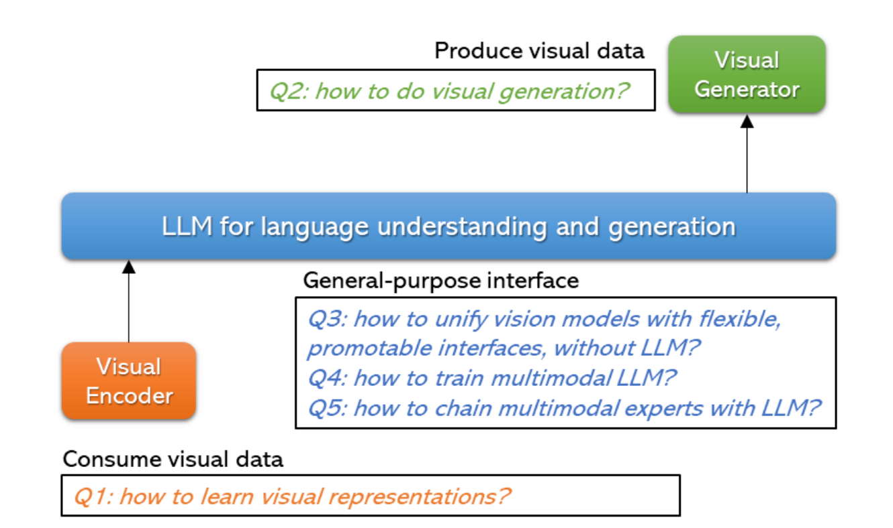
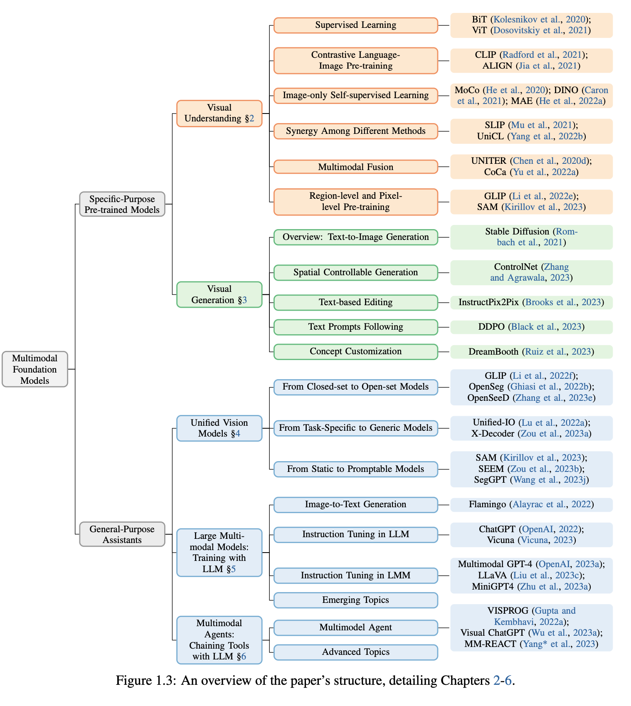
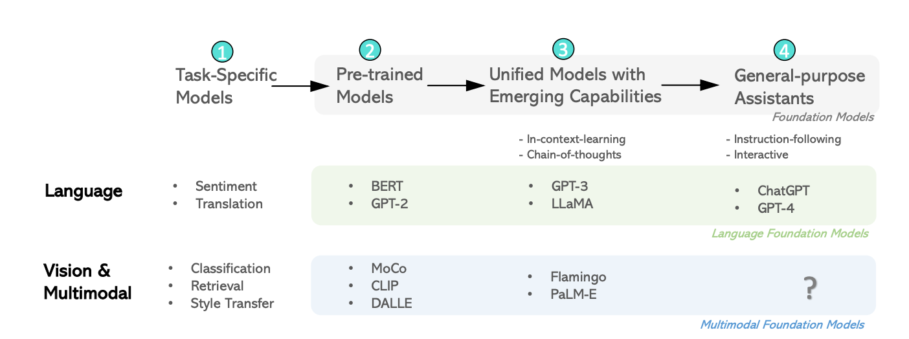

## LLM vs LMM vs LVM vs MLLM

[toc]

### 1 LLM（Large Language Model， 大语言模型）

**定义**

    指的是具有大量参数的语言模型，能够理解和生成自然语言。

    以自然语言处理（NLP）为核心任务。

**特点** ：

    基于 Transformer 架构。

    训练数据多为文本，如 GPT、BERT、T5 等。

    常见任务包括文本生成、问答、翻译、情感分析等。

**典型代表** ：

    GPT 系列（如 GPT-3、GPT-4）。

    Google 的 BERT 和 T5。

**应用场景** ：

    聊天机器人、智能客服、内容创作、代码生成等。

---

### 2 LVM（Large Vision Model，大视觉模型）

**定义** ：

    专注于计算机视觉任务的大型模型。

    主要处理图像或视频数据。

**特点** ：

    通常也基于 Transformer，如 Vision Transformer（ViT）。

    任务包括图像分类、目标检测、图像分割等。

**典型代表** ：

    Vision Transformer (ViT)。

    Swin Transformer。

    SAM（Segment Anything Model）。

**应用场景** ：

    自动驾驶、安防监控、医疗影像分析。

### 3 LMM（Large Multimodal Model，多模态大模型）

**定义** ：

    融合了多种数据模态（如文本、图像、音频、视频）的模型。

    能够同时处理多种模态的信息并进行联合推理。

**特点** ：

    需要处理模态间的信息交互和对齐问题。

    通常包含一个文本编码器（如 GPT/BERT）和一个图像编码器（如 CLIP/Vision Transformer）。

**典型代表** ：

    CLIP（对齐文本和图像的表示）。

    Flamingo（多模态对话）。

    BLIP（视觉-语言预训练模型）。

**应用场景** ：

    图像描述生成、图像问答、视频内容分析、跨模态搜索。

---

### 4 MLLM（Multimodal Large Language Model，多模态大语言模型）

**定义** ：

    一种特别的多模态模型，它**以语言模型为核心**，同时处理多模态数据。

    将 LLM 的语言生成能力与多模态理解相结合。

**特点** ：

    能处理和生成结合图像和文本的复杂信息。

    使用预训练语言模型（如 GPT-4）作为核心，通过融合其他模态的输入（如图像特征）实现多模态任务。

**典型代表** ：

    GPT-4 Vision（支持图像输入的 GPT-4）。

    MiniGPT-4（融合了 LLM 和视觉模型的轻量级多模态语言模型）。

**应用场景** ：

    图文问答、复杂任务分解、内容生成、对图像中的内容进行详细解释。

---

### 5 主要区别

| **概念** | **处理模态** | **核心任务** | **代表模型**      |
| -------------- | ------------------ | ------------------ | ----------------------- |
| LLM            | 文本               | NLP                | GPT-4, BERT             |
| LVM            | 图像/视频          | 视觉任务           | ViT, SAM                |
| LMM            | 文本 + 图像        | 多模态任务         | CLIP, Flamingo          |
| MLLM           | 文本 + 图像        | 多模态 + NLP       | GPT-4 Vision, MiniGPT-4 |

---

### 6 LMM 需要解决的问题和需要具备的能力？

如上图所示：多模态基础模型旨在解决的三个代表性问题的说明：**视觉理解任务**、**视觉生成任务**和**具有语言理解和生成功能的通用接口**

#### 6.1 视觉理解任务

**视觉理解任务的关键：学习通用的视觉表示**，因为预训练强大的视觉主干对所有类型的计算机视觉下游任务都是基本的，从图像级别（例如，图像分类、检索和字幕生成），到区域级别（例如，检测和定位），再到像素级别任务（例如，分割）。
我们根据用于训练模型的监督信号的类型，将这些方法分为三类。

* **标签监督**

  如 ImageNet（Krizhevsky等，2012）和 ImageNet21K（Ridnik等，2021）这样的数据集训练的方法
* **语言监督**：

  语言是一种更丰富的监督形式。如 CLIP（Radford等，2021）和ALIGN（Jia等，2021）这样的图文对监督训练的方法
* **图像自监督**：

  从图像本身挖掘的监督信号中学习图像表示，包括对比学习，非对比学习，以及遮挡图像建模等方法
* **多模态融合、区域级和像素级预训练**

  允许多模态融合以及区域级和像素级图像理解： 例如开放集物体检测，可提示分割的预训练方法。

#### 6.2 视觉生成任务

* **文本条件的视觉生成**：

  这一领域侧重于生成忠实的视觉内容，包括图像、视频等，条件是开放式文本描述/提示
* **与人类对齐的视觉生成器**

  包括提高空间可控性，确保更好地遵循文本提示，支持灵活的基于文本的编辑，以及促进视觉概念的定制等

#### 6.3  通用视觉模型

这部分主要是收到LLM的影响，NLP中LLM统一精神的启发，出现了chatGPT,GPT-4等大模型，那视觉领域应该如何走？

  这篇综述是2023年发表的，站在今天2024.12的节点，图中的问号已经有了明确的方向：GPT-4V,Gimini等模型

* **用于理解和生成的统一视觉模型**

  1 闭集->开集的统一：CLIP, Grounding-DINO, OWLV2, Yolo-world等

  2 粒度级别的统一： 例如I/O统一方法，如UniTAB， Unified-IO

  3 功能统一方法： SAM SEEM等
* **与LLM一起训练**

  通过将LLM的能力扩展到多模态设置并进行端到端的训练， 也就是后续的MLLM， 参考MLLM的综述
* **利用 LLM 链接工具**

  利用LLM的工具使用能力，越来越多的研究将LLM与各种多模态基础模型集成在一起，如RAG, 各种Agent工具组合使用。

### 7 参考链接

论文：[Multimodal Foundation Models: From Specialists to General-Purpose Assistants](https://arxiv.org/pdf/2309.10020)

PPT: [Multimodel Foundation Models PDF](https://datarelease.blob.core.windows.net/tutorial/vision_foundation_models_2023/slides/Chunyuan_cvpr2023_tutorial_lmm.pdf)

博客：[Multimodel Foundation Models Blog](https://blog.csdn.net/youcans/article/details/143630267)

英文视频讲解：[Multimodel Foundation Models Video](https://www.bilibili.com/video/BV1Ng4y1T7v3/?vd_source=7e4893f0f9c87c92a7335ef6a3787506)

中文视频讲解：todo
