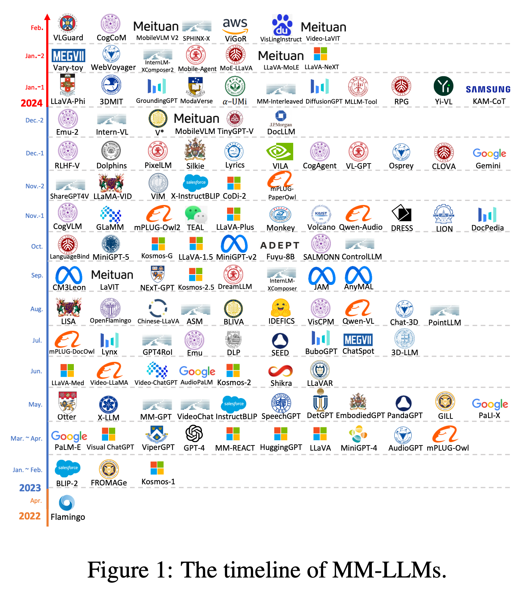
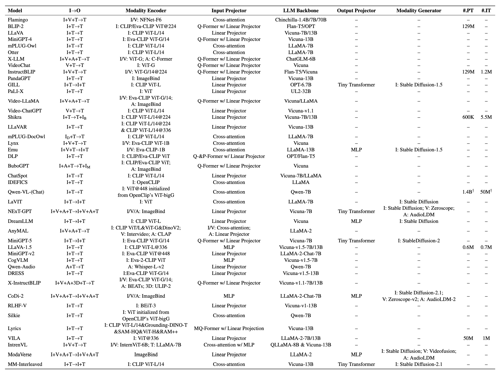

[TOC]
## 1 MLLM简介

 **多模态大语言模型（Multimodal Large Language Models, MLLM）** 的诞生源于对跨模态理解和生成能力的强烈需求。传统的大型语言模型（LLMs）在自然语言处理任务上展现了卓越的推理和生成能力，但由于其只能处理离散文本数据，缺乏对视觉信息的理解能力，从而限制了它们在需要结合视觉和文本信息的场景中的表现。与此同时，大型视觉模型（LVMs）具备强大的视觉感知能力，但在复杂推理和语言生成方面存在不足。基于这种互补性，研究者们开始探索将 LLM 和 LVM 的优势结合，从而推动了多模态大型语言模型的诞生。

## 2 发展历程

自从 GPT-4 和 Gemini 发布并展示惊人的多模态理解和生成能力以来，关于 MLLMs 的研究掀起了一股热潮。这一快速发展得益于学术界和工业界的共同努力。

* **最初** | 主要聚焦于多模态内容理解和文本生成，包括 (1) 图像-文本理解，例如 BLIP-2、LLaVA、MiniGPT4 和 OpenFlamingo 等项目；(2) 视频-文本理解，如 VideoChat 、Video-ChatGPT 和 LLaMA-VID；(3) 以及音频-文本理解，如 QwenAudio 等项目。
* **后续** | 模型能力得到进一步扩展，支持了更丰富的模态输出。这包括 (1) 具有图像-文本输出的任务，如 GILL、Kosmos-2、Emu 和 MiniGPT-5；以及 (2) 语音/音频-文本输出，如 SpeechGPT 和 AudioPaLM 等项目。
* **最近（截至 2024.03）** | 主要关注在任意模态之间的相互转换，为通用人工智能铺路。一些工作将 LLM 与外部工具结合，以达到接近任意模态对任意模态的理解和生成，例如 VisualChatGPT, HuggingGPT 和 AudioGPT。相反，为了减轻级联系统中的传播误差，NExT-GPT、CoDi-2 和 ModaVerse 等项目开发了端到端的 MLLMs 。

## 3模型架构

目前的多模态大语言模型采取并联式的框架，多模态数据送到各自模态的编码器后得到各自模态的编码，这些编码通过各自模态的输入转换器（Input Projection）后得到对齐到大语言模型的文本编码，经过大语言模型处理后的输出，经过限定模态的输出转换器（Output Projection）以及生成器得到多模态的数据。主要包含以下几个部分：

* **模态编码器** 负责将不同模态的输入编码成特征。
* **输入投影器** 负责将其他模态的特征投影到文本特征空间，并与文本特征一起输入给语言模型。
* **语言模型骨架** 一个预训练的语言模型，负责处理各种模态的特征，进行语义理解、推理和决策。
* **输出投影器** 负责将语言模型输出的信号转换成其他模态的特征，以供后续模态生成器使用。
* **模态生成器** 负责生成其他模态的输出。

### 3.1 模态编码器

**视觉编码器**

常用的图像编码器包括：**NFNet-F6** (Brock et al., 2021), **ViT** (Dosovitskiy et al., 2020), **CLIP ViT** (Radford et al., 2021), **Eva-CLIP ViT** (Fang et al., 2023), **BEiT-3** (Wang et al., 2023d), **OpenCLIP** (Cherti et al., 2023), **Grounding-DINOT** (Zhang et al., 2022b) with Swin-T (Liu et al., 2021b) backbone, **DINOv2** (Oquab et al., 2023), **SAM-HQ** (Kirillov et al., 2023) with MAE (He et al., 2022), **RAM++** (Zhang et al., 2023i) with Swin-B backbone, **InternViT** (Chen et al., 2023j), and **VCoder** (Jain et al., 2023).

对于视频输入，可以抽帧处理，拼接成图片进行处理。

**音频编码器**

常用的音频编码器包括：**CFormer** (Chen et al., 2023b), **HuBERT** (Hsu et al., 2021), **BEATs** (Chen et al., 2023g), **Whisper** (Radford et al., 2023), and **CLAP** (Wu et al., 2023e).

**3D 点云编码器**

主要为 **ULIP-2** (Salesforce, 2022) with a PointBERT (Yu et al., 2022) backbone.

### 3.2 输入投影器

输入投影器的任务是将其他模态的编码特征与文本特征空间对齐，对齐的特征将作为提示词和文本特征一起输入到 LLM 中。常见的方法是训练一个可学习的接口，或利用专家语言模型将其他模态的信息翻译成文本。最简单的对齐接口是通过一个**线性投影或 MLP** 将其他模态特征向量的维度与文本特征对齐。更复杂的实现有  **交叉注意力** , **Q-Former** (Li et al., 2023e), **PFormer** (Jian et al., 2023), 和 **MQ-Former** (Lu et al., 2023a). 使用专家模型也是融合不同模态信息的一种可行方法，例如利用一个图像描述模型将图片转换为文本描述再传入语言模型，但专家模型不如可学习接口灵活，而且可能导致信息损失。

### 3.3语言模型骨干

通过对在线语料库的大量无监督预训练，LLM 已经嵌入了丰富的世界知识，并表现出强大的泛化和推理能力。常用且公开可用的 LLM 包括 **Flan-T5** (Chung et al., 2022), **ChatGLM** (Zeng et al., 2022a), **UL2** (Tay et al., 2022), **Persimmon** (Elsen et al., 2023), **Qwen** (Bai et al., 2023a), **Chinchilla** (Hoffmann et al., 2022), **OPT** (Zhang et al., 2022c), **PaLM** (Chowdhery et al., 2023), **LLaMA** (Touvron et al., 2023a), **LLaMA-2** (Touvron et al., 2023b), and **Vicuna** (Chiang et al., 2023).

### 3.4 输出投影器

输出投影器将 LLM 的输出特征映射为模态生成器可理解的特征，通常是一个 **Tiny Transformer** 或 **MLP** 。

模态生成器

模态生成器负责产生不同模态的输出。主要使用现成的潜在扩散模型也就是 **Stable Diffusion** (Rombach et al., 2022) 来实现图像合成, 使用 **Zeroscope** (Cerspense, 2023) 来实现视频合成, 使用 **AudioLDM2** (Liu et al., 2023b,c) 来实现声音合成.

### 3.5 模态生成器

模态生成器负责产生不同模态的输出。主要使用现成的潜在扩散模型也就是 **Stable Diffusion** (Rombach et al., 2022) 来实现图像合成, 使用 **Zeroscope** (Cerspense, 2023) 来实现视频合成, 使用 **AudioLDM2** (Liu et al., 2023b,c) 来实现声音合成.

## 4 SOTA 模型

下面列出了主流 MLLM 的基本情况，[I→O] 说明了模型支持的输入输出格式 I=图像 V=视频 T=文本 A=音频 3D=点云，[Modality Encoder] 中 /14 代表图片的分块大小为 14x14，@224 代表输入图片的分辨率为 224x224. [#.PT][#.IT] 为预训练和指令微调阶段的训练数据量。

## 5 参考文献

[MM-LLMs: Recent Advances in MultiModal Large Language Models](https://arxiv.org/pdf/2309.10020)
