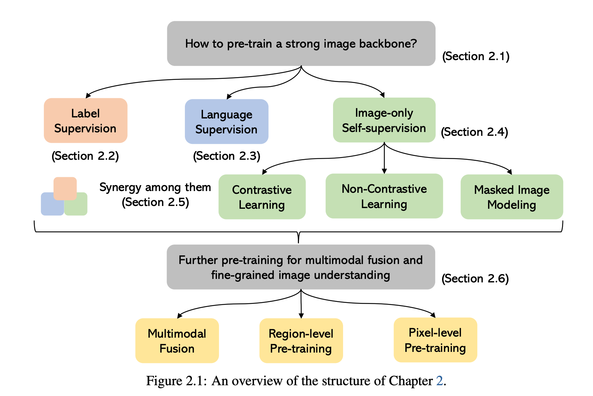
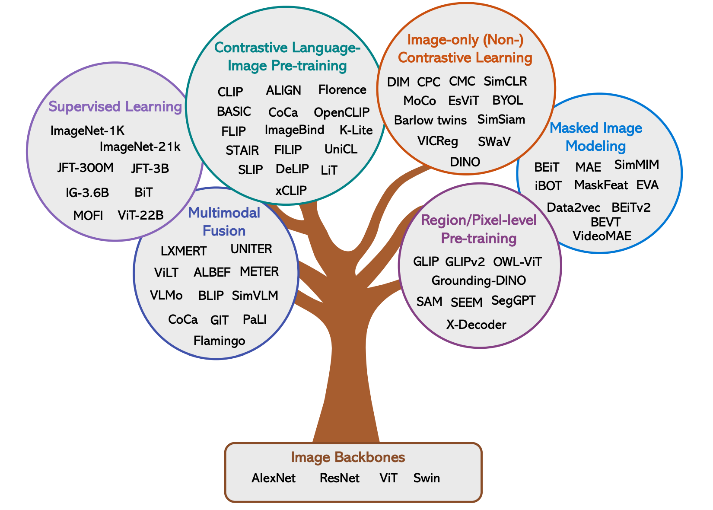

## 视觉理解的重要性

学习图像表示对于构建视觉基础模型至关重要，因为预训练一个**强大的视觉主干网络**来学习图像表示，是所有类型的计算机视觉下游任务的基础。包括：图像分类、图像-文本检索、图像字幕、区域级的目标检测、短语定位以及像素级的语义/实例/全景分割。

## 如何学习强大的视觉主干网络？

根据论文介绍，主要分为三大类： **标签监督、语言监督、图像自监督(对比学习，非对比学习，掩码图像建模)**

当前的主要方法

图片来源：[Multimodal Foundation Models: From Specialists to General-Purpose Assistants](https://arxiv.org/pdf/2309.10020)
