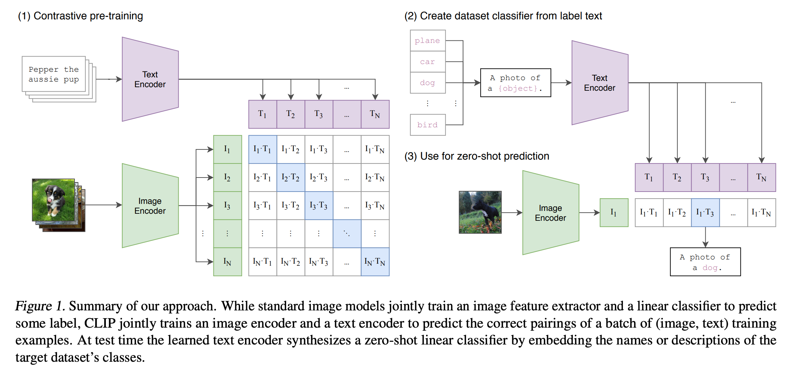

# CLIP

## 原理解读

[clip论文精度视频](https://www.bilibili.com/video/BV1SL4y1s7LQ/?vd_source=7e4893f0f9c87c92a7335ef6a3787506)     [clip-github](https://github.com/openai/CLIP/tree/main)       [clip论文](https://arxiv.org/pdf/2103.00020)     [clip论文翻译](https://blog.csdn.net/leiduifan6944/article/details/129813645)

**基于自然语言监督的对比学习方法**    CLIP 是涉及文字和图片的多模态领域的工作，它从文本中得到监督信号，引导视觉分类的任务。

将文字和图片分别通过一个编码器，得到向量表示，然后计算向量之间的相似度。其中文本编码器就是 Transformer；而图片编码器既可以是 Resnet，也可以是 Vision transformer，作者对这两种结构都进行了考察；左图展示了对比学习和预训练的过程，右图展现了zero-shot(零样本分类)的能力，关于论文更多的解读参考原文或者视频解读。

## CLIP体验

[colab](https://colab.research.google.com/github/openai/clip/blob/master/notebooks/Interacting_with_CLIP.ipynb#scrollTo=4W8ARJVqBJXs)

## CLIP 关键代码分析

## CLIP训练

https://github.com/yunhao-tech/Course_project/blob/master/Advanced%20Machine%20learning/Final%20project_CLIP.ipynb

## CLIP 部署
