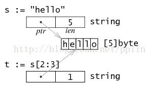

# [Go 中的 byte、rune 与 string](https://www.cnblogs.com/vio1etus/p/go-zhong-de-byterune-yu-string.html)

## byte和rune

**byte** 是 uint8 的别名，**表示字节**，byte 切片相比于不可变的 string 方便常用许多。它可以更改每个字节或字符。这对于处理文件内容(无论是文本文件、二进制文件还是来自网络的I/O流)非常有效。byte 切片是一个可变的字节序列

**rune** 是 int32 的别名，用来**表示 Unicode 字符**编码。rune 类似于 byte，不同点在于 rune 每个索引是一个字符而不是一个字节。rune 切片是对字节片的扩展使得每个索引都是一个字符。将1-3字节的字符用4字节代替。

如果你处理的文本文件有很多非 ascii 字符，比如中文文本、数学公式或带有表情符号的文本，使用 rune 是最好的。

rune 也是从字符串中获取子字符串的理想选择。它支持 Unicode 字符，没有数据损坏的风险。

```go
func main() {
	s := "GÖ"
	sample := "H哈"

	sByte := []byte(s)
	sRune := []rune(s)
	sampleByte := []byte(sample)
	sampleRune := []rune(sample)

	fmt.Printf("%s\nsByte: %d\nsRune: %d\n", s, sByte, sRune)
	fmt.Println("------")
	fmt.Printf("%s\nsampleByte: %d\nsampleRune: %d\n", sample, sampleByte, sampleRune)
}
```

**输出**

```go
GÖ
sByte: [71 195 150]
sRune: [71 214]
------
H哈
sampleByte: [72 229 147 136]
sampleRune: [72 21704]
```

## byte 和 rune 的区别

可以看到byte非 ASCII 码字符的 Unicode 编码为 1-3 字节，与 ASCII 码字符的字节数不一定相同。

byte和string->转换为rune时，内存占用会增大。

## string

string 是不可变的 byte 切片。因为Go中的源代码使用 utf-8 编码，因此每个字符串也使用utf-8编码，即 string 字面量是 utf-8 编码，以 byte 为单位的。string 中的每个字符实际占用 1-3 个字节，而每个 rune 占 4 个字节。

* 使用 rune() 可把 byte 为单位的字符转换为 rune 字符，对于 ASCII 字符来说，rune 值和 byte 值相同，而对于 Unicode 编码的字符来说便不同了。
* 使用 []rune() 将 string 转换 rune 数组。当将字符串转换为 rune 切片时，字符串中的每个 utf-8 字符被转换为一个 rune，从而获得包含字符串 Unicode 编码字符的新切片。
* 对于 string，len()和索引都是基于 byte（unint8）的
* 在 Go 中将字符串转换为 rune 切片是一个标准操作，没有数据损坏的风险。
  字符串是处理短字节或字符序列比较好的方法。每次对字符串进行操作(例如查找替换字符串或接受子字符串)时，都会创建一个新的字符串。如果字符串非常大，例如文件内容，则效率非常低。

### string 中索引字符

例如我们先看下面程序：

```go
func main() {

	sample := "Hel哈"
	for i := 0; i < len(sample); i++ {
		fmt.Print(sample[i], " ")
	}
	fmt.Println()
	fmt.Prgointf("%s\t的字节长度: %d\n", sample, len(sample))
	fmt.Printf("哈\t字符的字节长度: %d\n", utf8.RuneLen('哈'))
	fmt.Printf("%s\t的字符长度: %d\n", sample, utf8.RuneCountInString(sample))
}
```

输出：

```
go
72 101 108 229 147 136 
Hel哈   的字节长度: 6
哈      字符的字节长度: 3
Hel哈   的字符长度: 4
```

可以看出字符串的长度(len)和字符串的字符长度（RuneCountInString）是不同的。因为字符串是字节切片，Go 默认 UTF-8，存储非 ASCII 字符时，每个字符则会存储 1-3 个字节。所以想要正确地索引字符串中的字符有以下两种方法：

1. 手动将字符串转换为 rune 切片,然后range遍历
2. 直接使用 range 操作符迭代 Unicode 字符
   也就是说对字符串进行 rang 迭代，是字符迭代，而不是字节迭代。

```go

for i, val := range s {
	fmt.Println(s[i])       // 输出单字节的unicode值
	fmt.Println(val)        // 输出字符的unicode值
	fmt.Printf("%c\n", val) //输出字符
}
```

### string的内存分配



### len和sizeof

```go

str := "go语言"
fmt.Println(len(str))           //len是返回字节个数8
fmt.Println(unsafe.Sizeof(str)) // sizeof 是返回内存字节占用，而字符串的内存包括：指针+长度+实际:4+4+(1+1+3+3)=16
fmt.Println("------")
runeStr := []rune(str)
fmt.Println(len(runeStr)) // 返回字符数:4
fmt.Println(unsafe.Sizeof(runeStr))//指针+长度+内存字节:4+4+4*4=24
```

## 关于编码的一些方法

`utf8.ValidRune(chr)` 判断 chr 是否可以编码为合法的utf-8序列。
`utf8.RuneLen(chr)` 查看字符 chr 的字节长度
`utf8.RuneCount()` 查看字节数组中按照 rune 单位的字符长度
`utf8.RuneCountInString` 查看字符串按照 rune 单位的长度

## 参考资料

> 1. [Golang: How To Convert String To Rune in Go Example](https://appdividend.com/2020/03/12/golang-how-to-convert-string-to-rune-in-go-example/)
> 2. [go - What is a rune? - Stack Overflow](https://stackoverflow.com/questions/19310700/what-is-a-rune)
